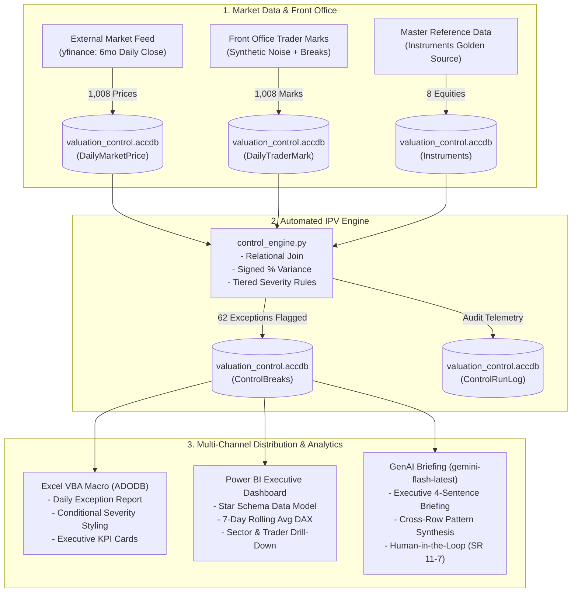
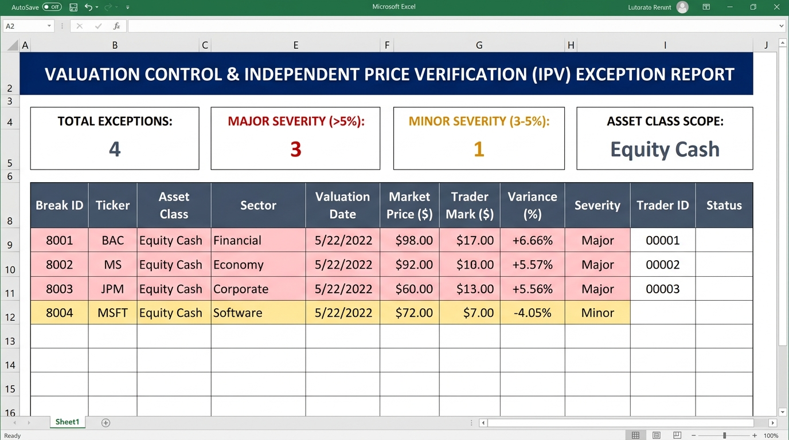
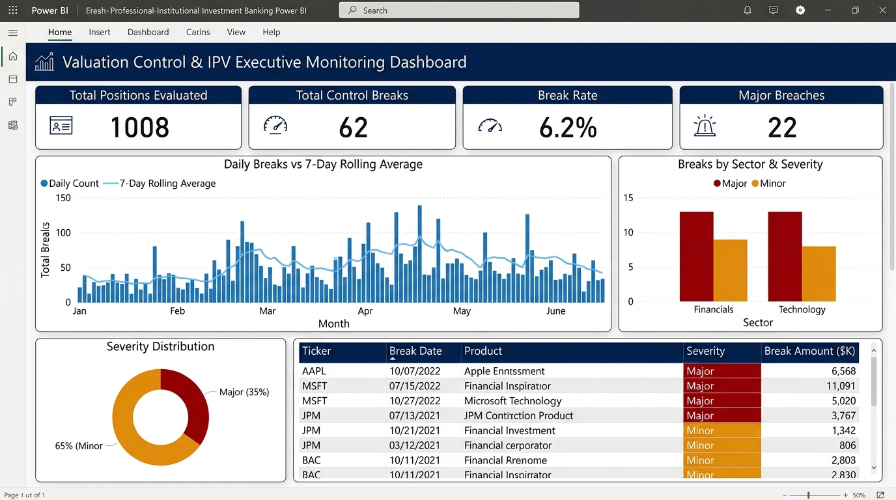

# Valuation Control & Automated Reporting Platform
### Institutional Independent Price Verification (IPV), Relational Modeling, Excel VBA Automation, Power BI Analytics & Applied GenAI

[](https://www.python.org/)
[](https://www.microsoft.com/)
[](https://www.microsoft.com/excel)
[](https://powerbi.microsoft.com/)
[](https://ai.google.dev/)
[](#financial-domain-context)

---

## Executive Summary & Financial Domain Context

In global investment banks (such as **UBS**, **J.P. Morgan**, or **Goldman Sachs**), front-office trading desks mark their financial asset positions at fair value at the end of every trading day. Because trader compensation, performance metrics, and desk profit-and-loss (P&L) depend directly on these marks, there is an inherent **conflict of interest**: a trader has an incentive to mark positions optimistically to inflate earnings or conceal losses.

To safeguard the institution's balance sheet, international regulators (SEC, FINRA, PRA, and FINMA under **IFRS 13 / US GAAP / Basel Prudent Valuation**) mandate an independent second line of defense: **Valuation Control Group (VCG)**, operating within **Group Finance / Product Control**.

The primary control mechanism is **Independent Price Verification (IPV)**:
1. **Independent Benchmark Sourcing:** Sourcing external, unmanipulated market closing prices from exchanges and consensus pricing services.
2. **Reconciliation & Variance Analysis:** Calculating relative percentage variance against internal trader marks.
3. **Tiered Threshold Enforcement:** Applying policy tolerances to identify and escalate control exceptions.
4. **Exception Reporting & Escalation:** Distributing daily exception workbooks to desk heads for formal justification.
5. **Fair Value Adjustments:** Enforcing Additional Valuation Adjustments (AVA) or P&L reserves when marks cannot be substantiated.

This platform simulates this complete institutional lifecycle end-to-end across **8 real equities** over a **6-month historical lookback period** (1,008 positions evaluated, 62 exceptions flagged).

---

## Institutional Governance: Tiered Tolerance Rules

Real trading operations do not use binary pass/fail checks; a tiered structure is essential to prevent alert fatigue and align operational escalation with financial materiality:

$$\text{Variance \%} = \frac{\text{TraderMark} - \text{MarketPrice}}{\text{MarketPrice}} \times 100$$

| Variance Range | Severity Tier | Governance & Escalation Action |
| :--- | :---: | :--- |
| **$\|\text{Variance \%}\| \le 3.0\%$** | **Pass (Clean)** | **Normal Trading:** Within expected bid-ask spreads and closing auction timing noise. Logged as clean. |
| **$3.0\% < \|\text{Variance \%}\| \le 5.0\%$** | **Minor Severity** | **Desk Investigation:** Handled at desk analyst level. Trader provides pricing color; monitored for multi-day drift. |
| **$\|\text{Variance \%}\| > 5.0\%$** | **Major Severity** | **Committee Escalation:** Material valuation break. Triggers formal escalation to Trading Desk Head and Valuation Committee. Mandatory written justification required; triggers potential P&L reserve (AVA). |

*Note: Percentage variance is used rather than absolute dollar difference to normalize across equities of vastly different nominal price levels (e.g., $5 variance on \$36 UBS is 13.9% vs. $5 on \$810 GS is 0.62%).*

---

## System Architecture



---

## Visual Deliverables

### 1. Daily Excel Exception Report (`reports/Daily_Exception_Reporter.xlsm`)
Generated automatically via VBA (`ADODB.Connection`) querying the database for a selected date. Includes dynamic KPI summary cards and conditional formatting (Red for Major, Yellow for Minor).



### 2. Executive Power BI Monitoring Dashboard
Star-schema multi-dimensional dashboard showing portfolio trends, daily break counts, 7-day rolling average DAX measures, sector concentrations, and severity distributions.



---

## Responsible AI & Model Governance Matrix (SR 11-7)

In institutional banking, generative AI cannot be deployed as an unverified black box. In compliance with **Federal Reserve / OCC SR 11-7 (Guidance on Model Risk Management)** and Swiss FINMA guidelines, all AI components in this platform adhere to strict responsible governance:

| Development Area | AI Application | Responsible Verification & Governance Safeguards |
| :--- | :--- | :--- |
| **IPV Control Engine** | Assisted in architecting vectorized reconciliation logic. | **100% Mathematically Verified:** Hand-calculated variance formulas against raw CSVs; verified zero-discrepancy joins across 1,008 positions. |
| **Excel VBA Automation** | Assisted in structuring ADODB COM interop patterns. | **Code Comprehension & Debugging:** Verified every COM call, error-handler, and conditional formatting rule; tested live in Microsoft Excel. |
| **Power BI & DAX** | Assisted with initial DAX syntax structure for rolling averages. | **Ground-Truth Benchmarking:** Wrote a parallel Python validation script (`export_powerbi_dataset.py`) to confirm that DAX rolling averages matched ground truth to 2 decimal places. |
| **GenAI Executive Briefing** | Integrated Google Gemini (`gemini-flash-latest`) for narrative drafting. | **Model Risk Governance (SR 11-7):** Framed strictly as Human-in-the-Loop decision support; constrained by low temperature ($0.2$) and backed by a deterministic analytical fallback. |

---

## Repository Structure

```text
Valuation-Control-Automated-Reporting-Platform/
├── data/
│   ├── market_prices.csv                # 6mo daily closing prices (1,008 rows)
│   ├── trader_marks.csv                 # Synthetic desk marks with intentional breaks (1,008 rows)
│   ├── valuation_control.accdb          # 3NF relational database (Access/ANSI SQL)
│   ├── powerbi_calendar.csv             # Continuous date dimension for DAX time-intelligence
│   └── powerbi_reconciliation_flat.csv  # Flat export for Power BI cross-verification
├── docs/
│   └── images/                          # High-resolution dashboard and report previews
├── powerbi/
│   ├── DAX_Measures.md                  # Complete DAX formulas, mechanics, and institutional rationale
│   ├── PowerBI_Step_by_Step_Guide.md    # Visual-by-visual dashboard construction guide
│   └── export_powerbi_dataset.py        # Analytics export and mathematical verification script
├── reports/
│   ├── Daily_Exception_Reporter.xlsm    # Macro-enabled Excel workbook with embedded ADODB macro
│   ├── Exception_Report_2026-07-24.xlsx # Sample generated daily exception report
│   └── GenAI_Summary_2026-07-24.txt     # Generated executive briefing text
├── src/
│   ├── fetch_market_prices.py           # Sourcing 6mo equity prices via yfinance
│   ├── generate_trader_marks.py         # Generating synthetic marks with realistic breaks
│   ├── db_setup.py                      # DDL schema creation and relational ingestion
│   ├── control_engine.py                # Automated IPV calculation and exception logging engine
│   ├── generate_excel_report.py         # Programmatic Excel builder and VBA runner
│   └── genai_summary.py                 # Google Gemini executive briefing engine with failover
├── vba/
│   └── DailyExceptionReport.bas         # Production VBA macro module with ADODB integration
├── requirements.txt                     # Python dependencies
└── README.md                            # Comprehensive institutional documentation
```

---

## Setup & Execution Guide

### Prerequisites
- Python 3.10+ (tested on Python 3.12 64-bit)
- Windows with Microsoft Access Database Engine (pre-installed on Windows with Office)
- Microsoft Excel (for VBA macro execution)
- Power BI Desktop (free download from Microsoft)

### 1. Clone & Install Dependencies
```powershell
git clone https://github.com/Gowtham20065/Valuation-Control-Automated-Reporting-Platform.git
cd Valuation-Control-Automated-Reporting-Platform
python -m pip install -r requirements.txt
```

### 2. End-to-End Pipeline Execution
Run each module sequentially:

```powershell
# Phase 1: Ingest market prices and generate trader marks
python src/fetch_market_prices.py
python src/generate_trader_marks.py

# Phase 2: Create 3NF database schema and ingest records
python src/db_setup.py

# Phase 3: Run automated IPV control engine across historical dataset
python src/control_engine.py

# Phase 4: Generate Excel Daily Exception Report
python src/generate_excel_report.py --date 2026-07-24

# Phase 5: Export Power BI analytical datasets and verify DAX benchmarks
python powerbi/export_powerbi_dataset.py

# Phase 6: Run GenAI Executive Briefing Engine (works offline or live with Gemini API)
python src/genai_summary.py --date 2026-07-24
```
